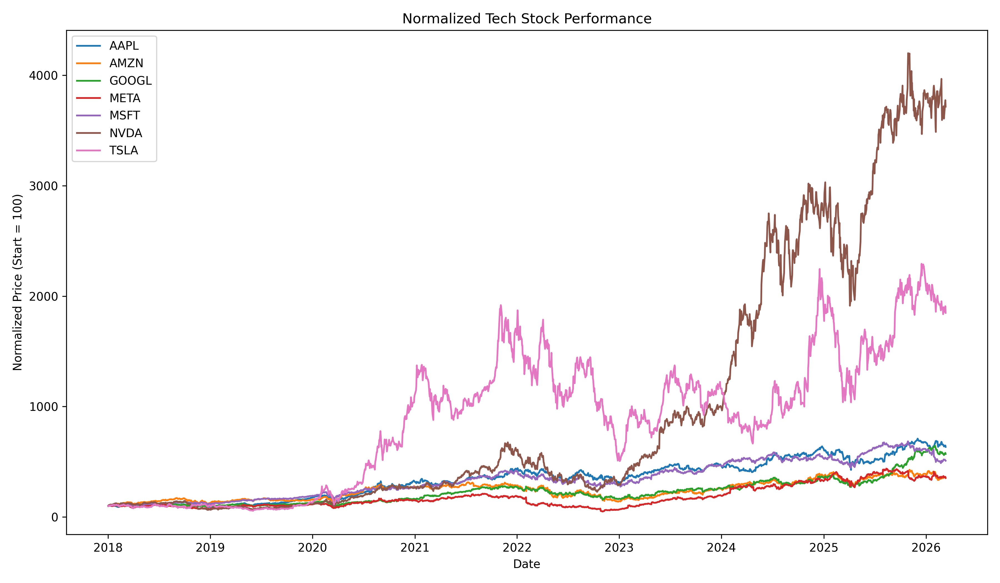

# Tech Stock Dynamics
### Relative Performance of Major Technology Stocks Through Time

A reproducible finance visualization project that explores how major technology stocks change in relative performance over time.

Goal: build a clean quant-style workflow: data → cleaned price panel → normalised performance series → ranking dynamics → static plots + animated visualisation.

## Preview



**Key takeaway:** this project compares major tech stocks on a normalized basis, showing how relative leadership changes over time rather than comparing raw share prices.

* * *
## Project structure (high level)

* `src/main.py` — downloads and prepares the raw + normalized datasets
* `src/plot_static.py` — creates a static normalized performance chart
* `src/plot_rankings.py` — creates a static daily ranking chart
* `src/animate_rankings.py` — creates the animated tech stock dynamics chart
* `data/` — downloaded datasets (kept out of git except a `.gitkeep`)
* `output/` — generated outputs (ignored by git, except selected tracked figures if needed)

* * *
## What this project does

* Download daily adjusted close data for selected major tech stocks
* Clean and align the time series into a common trading-date panel
* Normalise all stocks to a common starting value for fair comparison
* Build ranking data showing how leadership changes over time
* Produce:
  * static comparison charts
  * a static ranking chart
  * an animated bar-chart-style visualisation of changing stock leadership

* * *
## Current stock universe

* AAPL
* MSFT
* NVDA
* GOOGL
* AMZN
* META
* TSLA

* * *
## Reproduce locally

### 1) Create venv + install deps

```bash
python3 -m venv .venv
source .venv/bin/activate
python -m pip install --upgrade pip
pip install -r requirements.txt